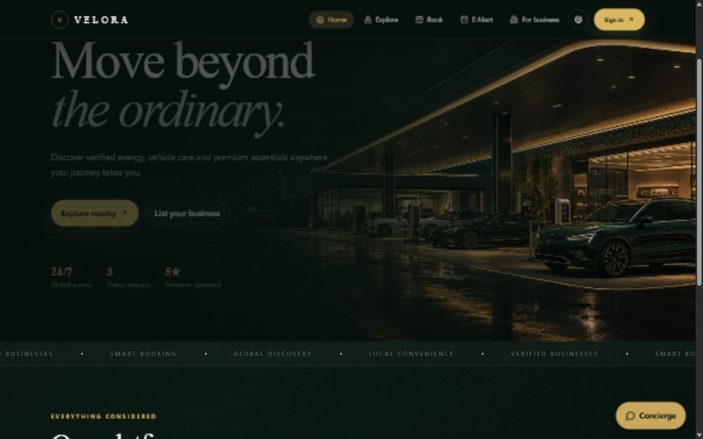
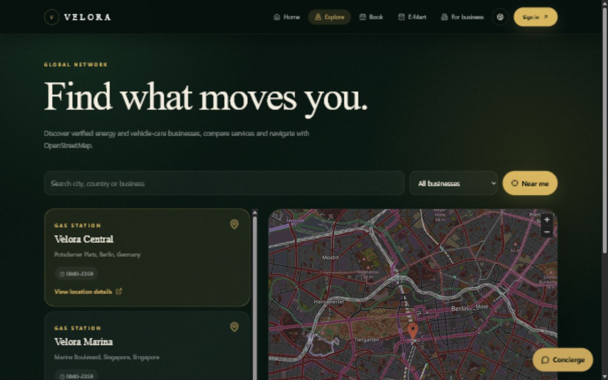
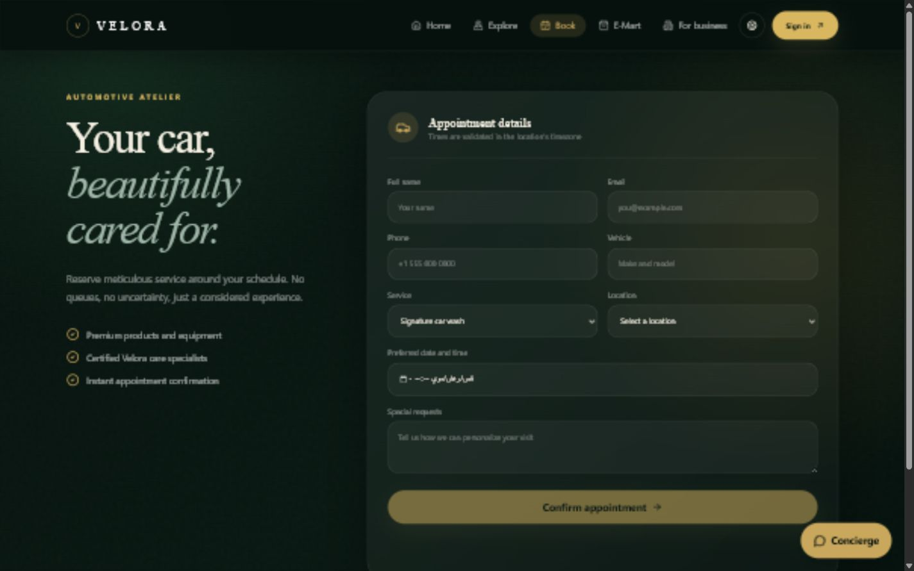
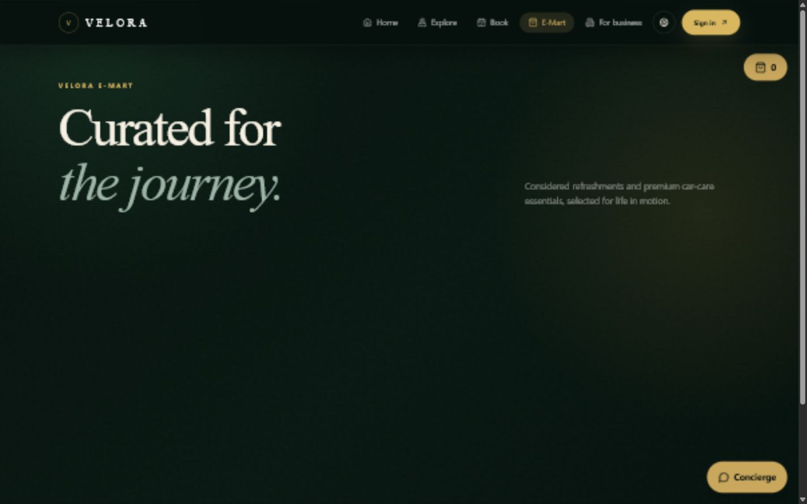
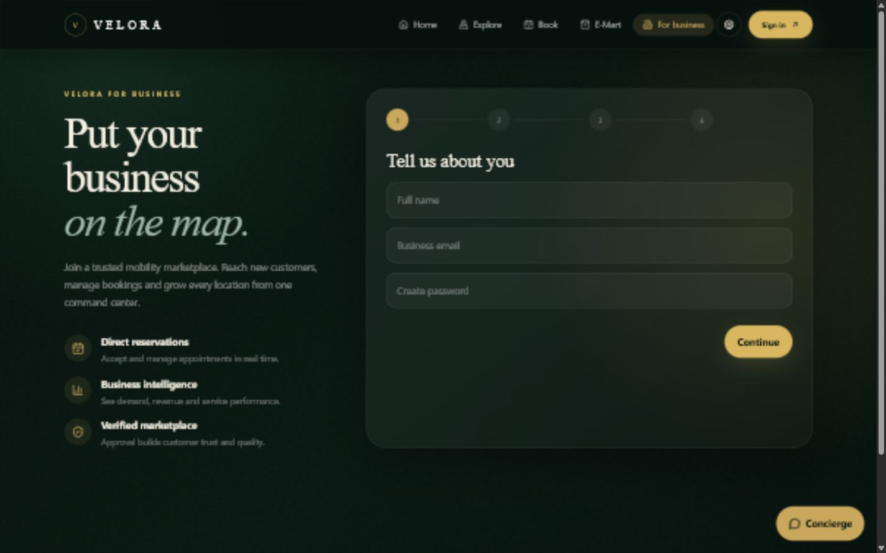
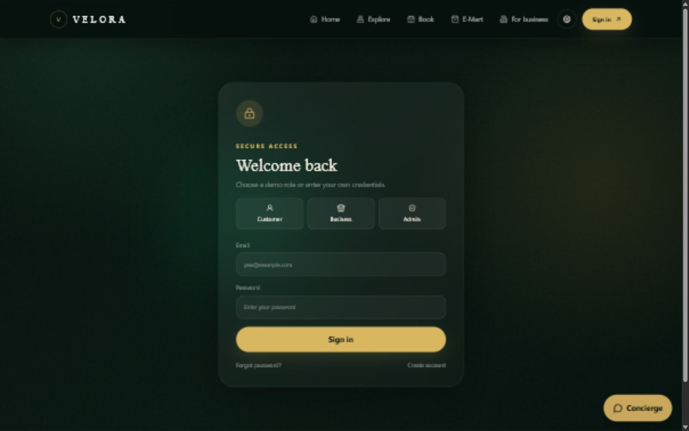
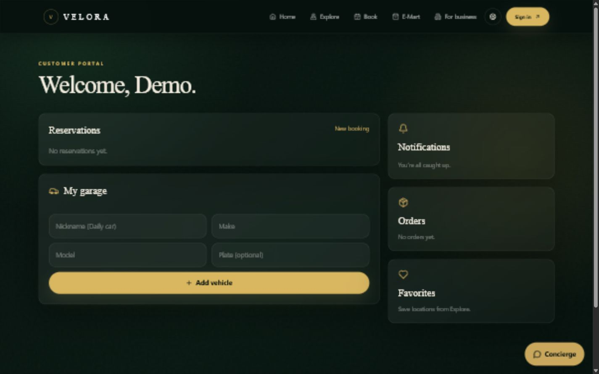
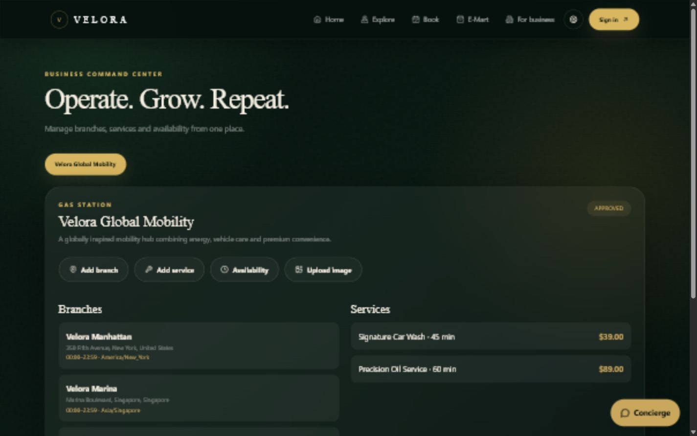
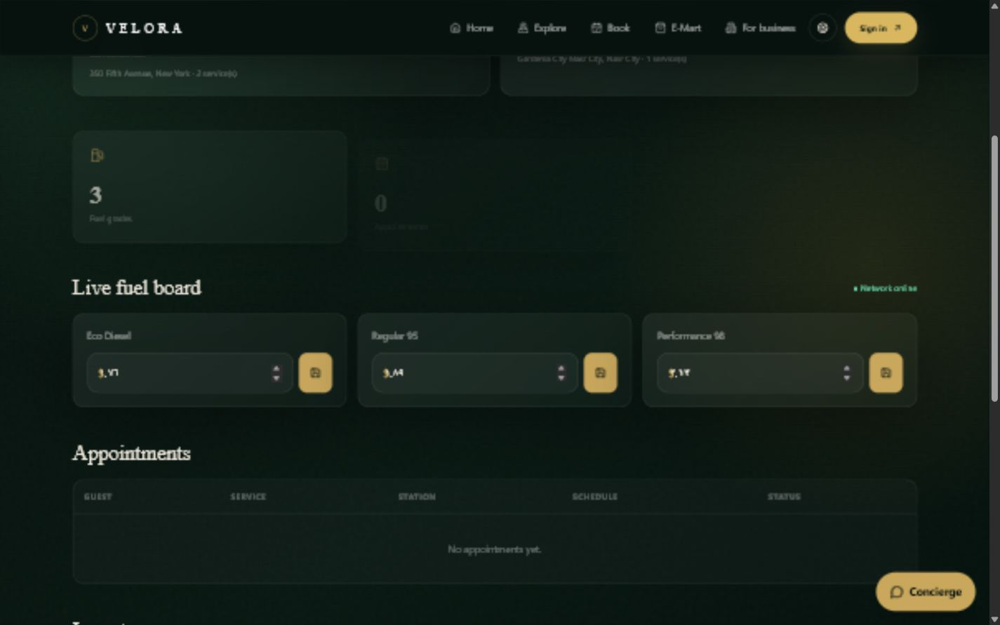
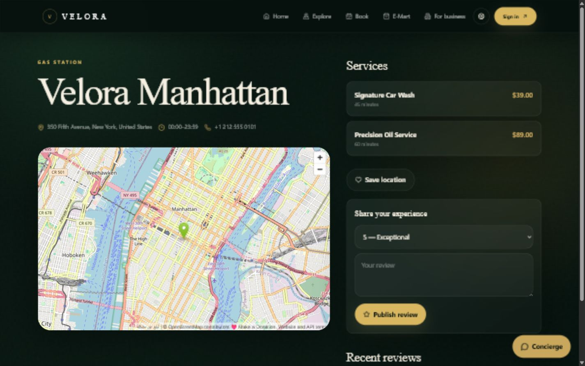

# Velora Mobility Marketplace

A production-oriented, multi-role full-stack marketplace for gas stations, car washes and vehicle service centers.

**Product design and development:** Kareem Swidan

## Highlights

- Customer, business-owner and platform-admin portals
- Verified business onboarding and moderation
- Global discovery with country filters, geolocation, distance and OpenStreetMap
- Conflict-aware vehicle-care reservations with timezone support
- Favorites, verified reviews, vehicles, notifications and password recovery
- E-Mart catalog, inventory-safe local demo checkout and order history
- Local image uploads (JPG, PNG, WebP up to 5 MB)
- English/Arabic navigation with persisted RTL/LTR preference
- Audit logs, CSV exports, rate limiting and security headers
- SEO metadata, sitemap, robots, manifest, loading/error/404 states
- Automated core tests and production build checks

## Product gallery

### Customer experience

| Home | Explore locations |
|---|---|
|  |  |

| Booking | E-Mart |
|---|---|
|  |  |

| For business | Secure access |
|---|---|
|  |  |

### Role-based portals

| Customer portal | Business dashboard |
|---|---|
|  |  |

| Platform administration | Location details |
|---|---|
|  |  |

## Stack

Next.js 14 App Router, React 18, TypeScript, MySQL/MariaDB, Prisma ORM, Tailwind CSS, Framer Motion, JOSE JWT, bcrypt and Node's test runner.

## Quick start

Requirements: Node.js 20+, npm, and MySQL 8+ or MariaDB 10.6+.

```powershell
Copy-Item .env.example .env
npm.cmd install
npm.cmd run db:push
npm.cmd run db:seed
npm.cmd run dev
```

Open `http://localhost:3000`.

## Demo accounts

| Role | Email | Password |
|---|---|---|
| Platform admin | admin@velora.energy | VeloraAdmin2026! |
| Business owner | owner@velora.demo | OwnerDemo2026! |
| Customer | customer@velora.demo | CustomerDemo2026! |

Change all demo credentials and `JWT_SECRET` before public deployment.

## Useful commands

```powershell
npm.cmd run test
npm.cmd run build
npm.cmd run check
npx.cmd prisma studio
```

## Free local integrations

- Maps: OpenStreetMap embed and browser geolocation
- Payments: local mock checkout stored in MySQL; no funds are charged
- Images: `public/uploads` local filesystem storage
- Email: password-reset links are printed to the server console and returned in development
- Rate limiting: in-memory limiter suitable for a single local process

For multi-instance production hosting, replace local uploads and in-memory rate limits with persistent infrastructure.

## Main routes

- `/` global landing page
- `/stations` searchable global discovery map
- `/stations/[id]` location details and reviews
- `/booking` reservations
- `/store` E-Mart and demo checkout
- `/partners` business onboarding
- `/account` customer portal
- `/business` owner operations portal
- `/admin` platform administration
- `/api/health` health check

## Verification

`npm run check` runs automated tests and a full optimized production build. A successful build type-checks every page and API route.

